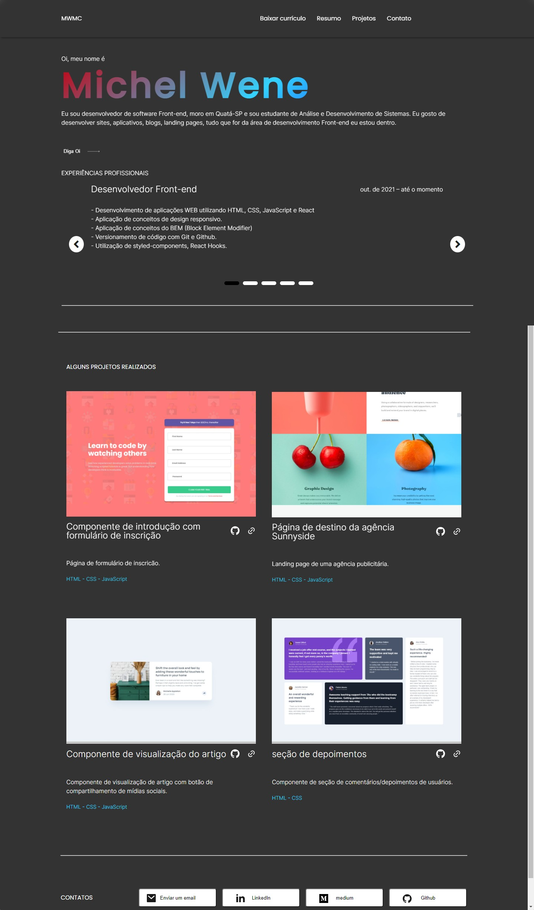
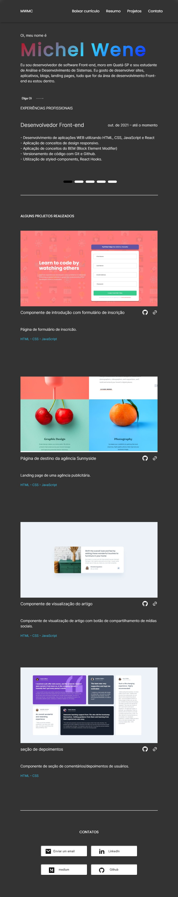
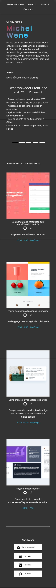

# Portifólio pessoal.

Este é um projeto que desenvolvi como meu portifólio pessoal. O intuito deste projeto é colocar meus conhecimentos em prática e criar meu portifólio pessoal.

## Resumo de conteúdos

- [Visão Geral](#Visão-Geral)
  - [O desafio](#O-desafio)
  - [Captura de tela](#Captura-de-tela)
  - [Links](#Links)
- [Meu processo](#Meu-processo)
  - [Construído com](#Constrído-com)
  - [O que eu aprendi](#O-que-eu-aprendi)
  - [Continuação dos desenvolvimentos](#Continuação-dos-desenvolvimentos)
  - [Recursos utilizados](#Recursos-utilizados)
- [Autor](#Autor)

## Visão Geral.

### O desafio

Os usuários devem ser capazes de:

- Visualizar estados de foco para elementos interativos.
- Criação de um portifólio pessoal
- Observar um design responsivo.
- Observar menu carrosel com as experiências profissionais.

### Captura de tela

- Desktop
<p  align="center" >
  
</p>

- Tablet
<p  align="center" >

</p>

- Mobile
<p  align="center" >

</p>

### Links

- Solução URL: [https://github.com/michelwene/personal-portfolio](https://github.com/michelwene/personal-portfolio)
- Site URL: [https://michelwene.github.io/sunnyside-agency-landing-page/](https://michelwene.github.io/sunnyside-agency-landing-page/)

## Meu processo

### Construído com

- HTML5
- CSS3
- Flexbox
- Design responsivo
- EMMET
- JavaScript

### O que eu aprendi

```css
@media screen and (max-width: 768px) {
  .header {
  background-color: rgba(51, 51, 51, 0.15);
  backdrop-filter: blur(10px);
  box-shadow: 3px 2px 5px rgba(17, 17, 17, 0.55);
  align-items: center;
  display: flex;
  height: 100px;
  width: 100%;
  left: 0;
  position: fixed;
  top: 0;
  -webkit-backdrop-filter: blur(10px);
}

/*Criação de um header com efeito de espelho.*/

.presentation__name {
  background: linear-gradient(
    0.9turn,
    var(--lilas),
    var(--azul),
    var(--vermelho)
  );
  background-clip: text;
  -webkit-background-clip: text;
  -webkit-text-fill-color: transparent;
  font-weight: 700;
  letter-spacing: 5px;
  padding: 1rem 0;
}

/*criação de um nome com as cores em degradé*/

@media screen and (min-width: 0) {
  .projects {
    flex-direction: column;
    flex-wrap: nowrap;
    row-gap: 100px;
  }

  .project {
    width: 100%;
    text-align: center;
  }
}

@media screen and (min-width: 768px) {
  .project {
    text-align: left;
  }
}

@media screen and (min-width: 1150px) {
  .projects {
    flex-direction: row;
    flex-wrap: wrap;
    row-gap: 60px;
  }
  .project {
    width: 511px;
  }
}
/*A questão da responsividade ficou muito boa neste projeto, consegui adaptar muito bem cada elemento da página para determinados tipo de tamanho de tela.
```

```javaScript
var slider = tns({
  container: ".my-slider",
  items: 1,
  speed: 600,
  autoplay: true,
  autoplayButtonOutput: false,
  controlsContainer: "#custom-control",
  mode: "gallery",
  responsive: {
    0: {
      nav: true,
      navPosition: "bottom",
      autoplay: false,
    },
    1024: {
      autoplay: true,
    },
  },
});

/*utilizando o tiny Slider2, eu passei uma variavel, e dentro desta variavel eu montei o menu carrossel, que dentro dele contêm minhas experiências profissionais.*/
```

### Continuação dos desenvolvimentos

Pretendo continuar fazendo diversos projetos para aumentar minha experiência no desenvolvimento de software, utilizandos as tecnologias de front end.
### Recursos utilizados

- [Stackoverflow](https://stackoverflow.com/) - Este site me ajudou muito na realização das funções do javascript.
- [Tiny Silder2](https://ganlanyuan.github.io/tiny-slider/) - Utilizei o tiny-slider2 para realizar o carrossel de experiências profissionais.

## Autor

- Linkedin - [@michelwene](https://www.linkedin.com/in/michelwene/)
